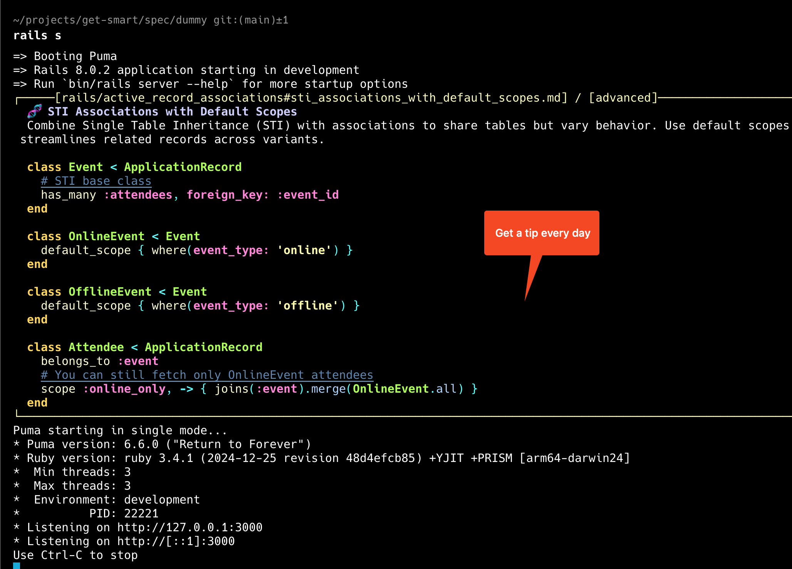
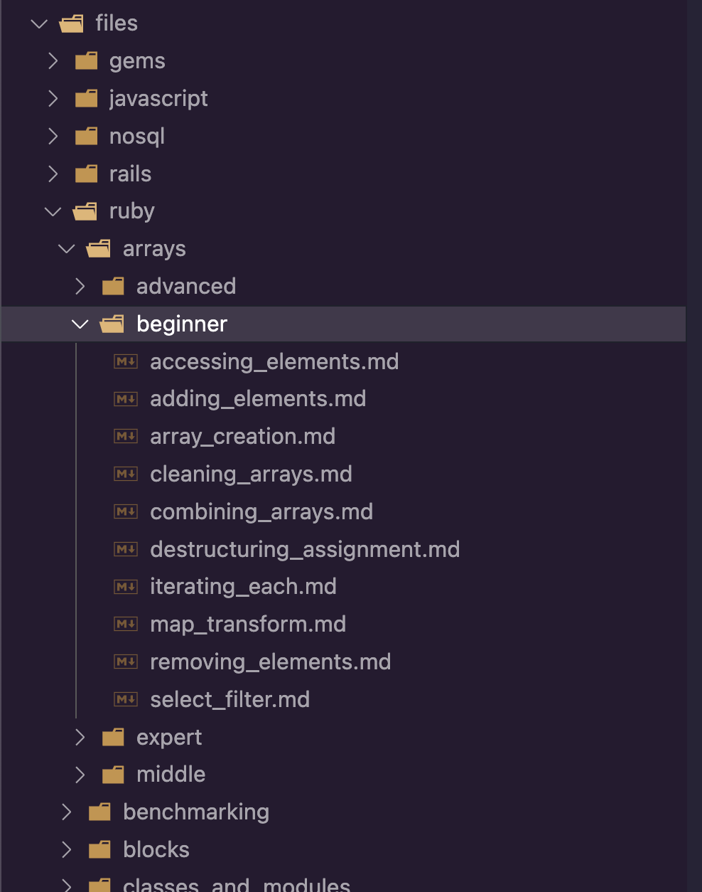

# Get::Smart - Learn Ruby and Rails by examples



Learn something new every time you boot your Rails application.

An important note: all tips were generated by AI (using o4-mini). Quick and dirty. I've checked a few of them and they are valid.

Behind the scenes I have a simple logic to avoid showing the same tip twice and showing contextual tips (based on Gemfile, package.json, etc). Not everything is ready yet, but I'm working on it.

If you want to contribute, please create a PR with your changes.

## Usage

Just add the gem into your Gemfile. And start your Rails application.

Gem supports a few options to customize the behavior. See #Options for more details.

## Installation

Add this line to your application's Gemfile:

```ruby
gem "get-smart", group: :development
```

And then execute:

```bash
$ bundle
```

## Options

You can configure the gem in your `config/initializers/get_smart.rb` file.

To create the default config file run:

```bash
rails g get:smart:install
```

And edit the generated file.

```ruby
if defined?(Get::Smart)
  Get::Smart.setup do |config|
    # Enable or disable Get::Smart. Default: Rails.env.development?
    config.enabled = Rails.env.development?

    # Print file details. Default: false
    config.print_file_details = true

    # Show tips only for these levels. Default: [:advanced, :expert]
    config.level = [ :advanced, :expert ]
    # config.level = [:any, :beginner, :middle, :advanced, :expert]

    # Frequency for showing tips. Default: :always
    config.frequency = :always
    # Available options:
    #   :always, :half_hourly, :hourly, :every_two_hours, :every_three_hours,
    #   :every_four_hours, :every_five_hours, :every_six_hours, :every_seven_hours,
    #   :every_eight_hours, :every_nine_hours, :every_ten_hours, :every_eleven_hours,
    #   :every_twelve_hours, :daily, :every_two_days, :weekly

    # Path to the memory file. Default: ~/.get-smart-memory
    # config.memory_file_path = File.expand_path("~/.get-smart-memory")
  end
end
```

## Development

All content is stored in the `files` folder.

```bash
# set OPENAI_API_KEY in .env, it can be used in bin/generator to create new tips. See source of bin/generator for more details.

# in the root of the project
cd spec/dummy
bundle install --gemfile /Users/igor/projects/get-smart/Gemfile
rails c

# or in the root of the project

bin/run
```

To run specs:

```bash
# in the root of the project
rspec
```

Run command `bin/dev` for development and testing.
Run command `bin/run` to print random tip.

Linting:

```bash
bin/rubocop -f github
# to fix errors automatically
bin/rubocop -A
```

## Content Generator CLI

Using Open AI API to generate tips (see example below in the readme, in #structure-of-the-files).

In gem root run:

```bash
bin/generator <topic> <path> <count> <level>
```

Example:

```bash
bin/generator "ruby on rails security tips & tricks" "rails/security" 10 "middle"
```

Later you can verify the tips with (see #Verifier for more details).

```bash
bin/verifier files/rails/security
```

## Tree (in Rails app)

Get a tree of all the tips in the `files` folder (according to the current gem config).

```bash
bin/rails get_smart:tree
```

To see the stats about the tips.

## Structure of the files



All content is stored in the `files` folder. Just use a similar structure to store your tips.

Every file is a tip on a specific topic, must be named like `topic1.md`, `topic2.md`, etc (as markdown files).

Every tip should start with a special comment with the tip title, for example:

```ruby
### 💎 Ruby Gem Tip: Generate Clean URLs Easily with `babosa`
```

Put file in any of the folder "<folder>/<topic>/<beginner|middle|advanced|expert>/<tip_title>.md"

Rules:

- Beginner - tips for beginners
- Middle - tips for middle level developers
- Advanced - tips for advanced developers
- Expert - tips for expert developers

You can use CLI to add new folders for topics:

```bash
bin/new gems/devise
```

Example:

Change the topic to "file compression in ruby" and specify number of tips to generate for each level.

```bash
bundle exec bin/generator "file compression in ruby beginner usage examples"          "files/ruby/compression"         2 "beginner"
bundle exec bin/generator "file compression in ruby middle usage examples"            "files/ruby/compression"         2 "middle"
bundle exec bin/generator "file compression in ruby advanced usage examples"          "files/ruby/compression"         2 "advanced"
bundle exec bin/generator "file compression in ruby expert usage examples"            "files/ruby/compression"         2 "expert"
```

To create folders in files/gems/devise folders (beginner, middle, advanced, expert).

## Verifier

Verifier uses Gemini API to verify the tips (an additional step to ensure the quality of the tips). Setup Gemini API key in `.env` file.

To verify the tips run:

```bash
bin/verifier files/gems/devise
```

## Tasks

- readme updates, how to use, options, how to contribute, links to other repos
- tips specific to the project (based on Gemfile, package.json, DB, etc)
- maybe exclude from running rake tasks? at least with some flag
- allow adding custom paths (already kind of done, but lets see if it's really needed)
- think about nicer way to print tip in the console?
- better contextual suggestions? (handle JS, CSS, React, etc). See @learning_path.rb
- more topics
- improve code coverage

## Contributing

You are welcome to contribute to the gem.

## License

The gem is available as open source under the terms of the [MIT License](https://opensource.org/licenses/MIT).
